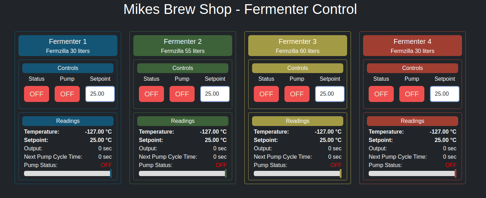
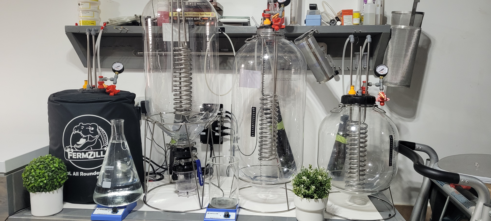
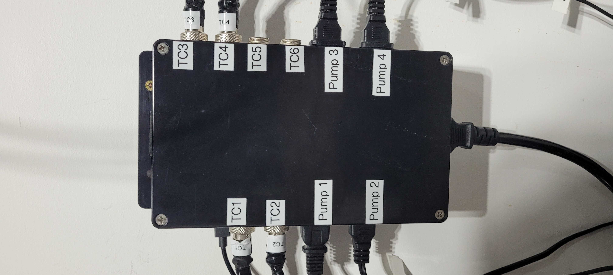
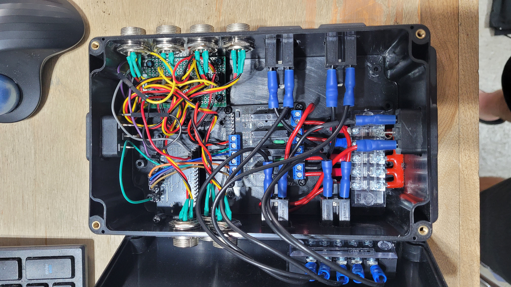
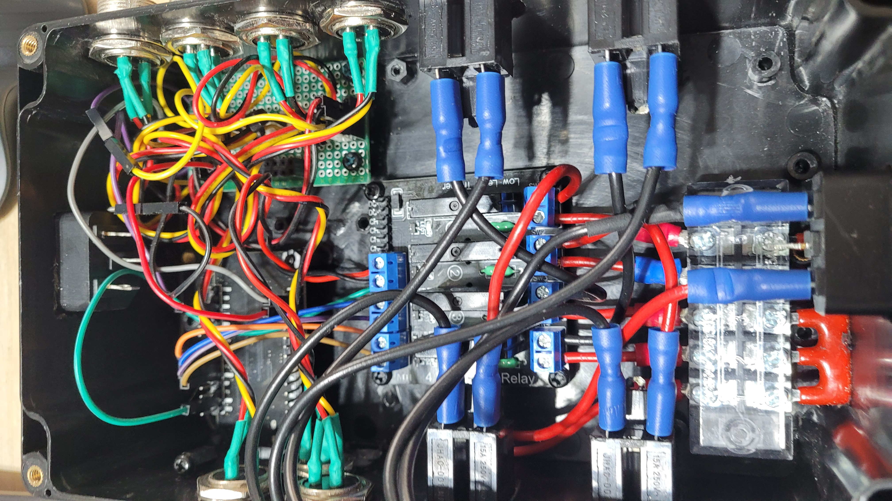

This code provides a **network-enabled, real-time, multi-fermenter temperature control system** with **remote monitoring capabilities**. The use of PID control ensures **precise temperature stability**, making it ideal for fermentation management.

This code implements a **fermentation temperature control system** for up to **four fermenters** (more if you modify the code) using an FREENOVE ESP32 WROOM BOARD **ESP32 (or similar ESP-based microcontroller)**. The system is designed to monitor and regulate temperature using **PID controllers**, **DS18B20 temperature sensors**, and **relays** to control cooling elements. This code controls 4 aquarium pumps inside a glycol chiller.

Here's a high-level breakdown of its functionality:

This code is developped using Visual Studio Code with the Platformio extension.

### **Main Features**
1. **Temperature Sensing**  
   - Uses **DS18B20 temperature sensors** on a **OneWire bus** to measure temperature.  
   - Each fermenter has a pre-registered unique **sensor address**.

2. **PID Control**  
   - Implements **Proportional-Integral-Derivative (PID) control loops** for precise temperature regulation.  
   - Uses different PID tuning parameters (`Kp`, `Ki`, `Kd`) for **small and large fermenters**.  
   - The control logic is **inverted**, meaning relay activation logic may be reversed.
   - The PID operates within a 300-second time window, during which it can activate the pump for a specific duration to cool the fermenter coil. For small fermenters, this duration is limited to 30 seconds, whereas for large fermenters, it can span the entire window.
   - Temperature measurements are taken every second and averaged, while the PID computation is performed every 30 seconds.

3. **WiFi & Web Server**  
   - Connects to WiFi via `setupWiFi()`.  
   - Hosts an **async web server** (`ESPAsyncWebServer`) on port **80** for remote monitoring and control.  
   - Supports **WebSockets** (port **3333**) for real-time communication with clients.

4. **Persistent Storage**  
   - Uses **LittleFS** for storing and retrieving webpage.  
   - Saves fermenter **setpoints** and **status** for persistence across reboots using <Preferences.h>

5. **Relay Control**  
   - Interfaces with relays to **turn cooling devices on/off** based on PID output.  
   - Relays are initialized in `setupRelays()`.
   - The relay are solid state relay.

6. **Event Loop & Timing**  
   - The `loop()` function:  
     - Reads temperatures from sensors every **1 second**.  
     - Runs the **PID control loop** to adjust fermenter temperatures.  
     - Sends updated data to connected clients.  
     - Handles WebSocket events.

### **TODO List**
- **Synchronize time with NTP** for accurate logging and scheduling.  
- **WiFi reconfiguration mode** (pressing a button during reboot to enter setup mode).  
- **Clarify inverted relay logic** in documentation.  
- **Make PID settings adjustable** via the web interface.  
- **Dynamically detect and assign DS18B20 sensors** instead of hardcoding addresses.
- **Add a heating device** add heating device for fermentation temperature above ambiant temperature.
- **Design a board with kicad** that integrates all the electronics.

### Source code
Here's the source code and header files for this project:
```
src/
├── fermenter_control.cpp
├── main.cpp
├── read_ds18b20_temp.cpp
├── relay_control.cpp
├── storage.cpp
├── web_server.cpp
└── wifi_setup.cpp
include/
├── fermenter_control.h
├── read_ds18b20_temp.h
├── README
├── relay_control.h
├── storage.h
├── web_server.h
└── wifi_setup.h
```

# Configuration

### Configuration for websocket
If you publish your website hosted on the ESP32 on the internet, and using Nginx docker container as a reverse proxy, you need to add the following configuration to the specified file used by the Nginx container:

File: /srv/docker/nginx/etc/nginx.conf

Append the following configuration at the end of the http {} block, xxx.xxx.xxx.xxx is the ip address of your ESP32 on your local network:

        server {
            listen 443 ssl;
            server_name nodemcu.mikesbrewshop.com;

            ssl_certificate /etc/nginx/certificate/fullchain1.pem;
            ssl_certificate_key /etc/nginx/certificate/privkey1.pem;

            location / {
                proxy_pass http://xxx.xxx.xxx.xxx;
                proxy_http_version 1.1;
                proxy_set_header Upgrade $http_upgrade;
                proxy_set_header Connection "upgrade";
                proxy_set_header Host $host;
            }

            location /ws {
                proxy_pass http://xxx.xxx.xxx.xxx:3333;  # WebSocket server port
                proxy_http_version 1.1;
                proxy_set_header Upgrade $http_upgrade;
                proxy_set_header Connection "upgrade";
                proxy_set_header Host $host;
            }
        }



|  |  | |
|---------|---------|---------|
|  |  |  |